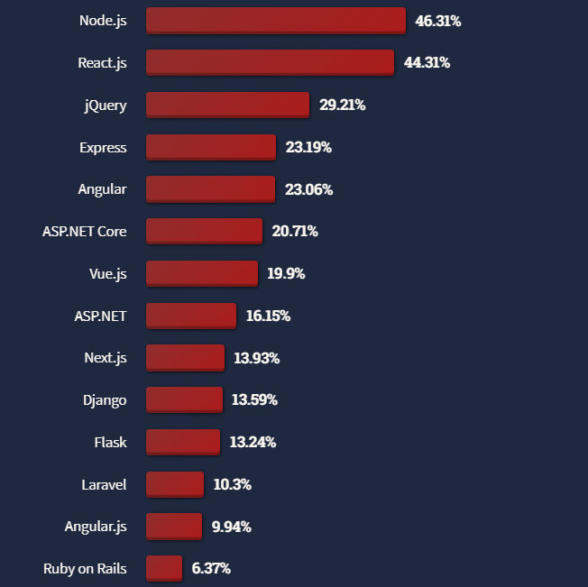
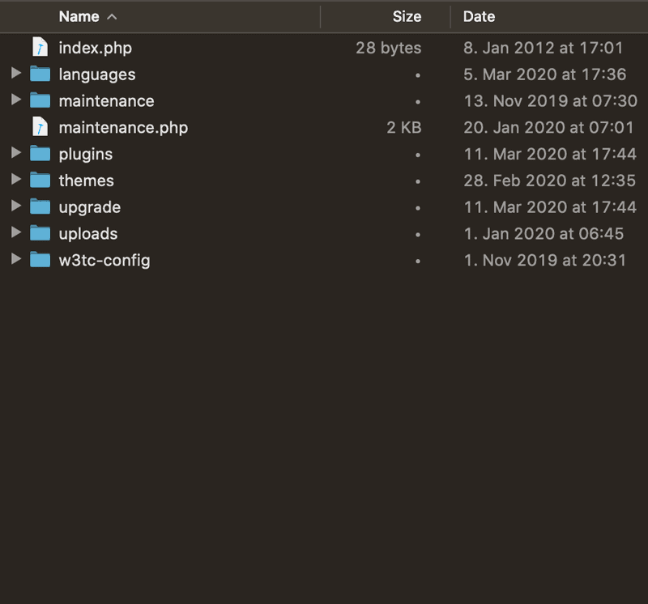

# Common Web Application File Structure Patterns

## Table of Contents

- [Curent Trends in Web Application Framework Use](#current-trends-in-web-application-framework-use)
- [Node.js/Express](#nodejsexpress)
- [React](#react)
- [Angular](#angular)
- [Next.js](#nextjs)
- [ASP.NET CORE](#aspnet-core)
- [WordPress](#wordpress)
- [Flask](#flask)
- [Django](#django)
- [Svelte](#svelte)
- [Ruby on Rails](#ruby-on-rails)

## Current Trends in Web Application Framework Use:

### Statista 2023 Survey on Most Used Web Frameworks Among Developers Worldwide:

<a href="https://www.statista.com/statistics/1124699/worldwide-developer-survey-most-used-frameworks-web/" rel="nofollow"></a><br />Find more statistics at  <a href="https://www.statista.com" rel="nofollow">Statista</a>


### Stack Overflow 2022 Survey on Most Popular Web Frameworks and Technologies:



_Source: <https://survey.stackoverflow.co/2022/?ref=hackernoon.com#most-popular-technologies-webframe-prof>_

## Node.js/Express

For smaller applications, the structure does not matter that much. Once the application starts to grow in size, we are going to have to establish some kind of structure and separate the different responsibilities of the application into separate modules. 

There is no strict directory structure or file naming convention that is required for Express applications. In contrast, Ruby on Rails does require a specific structure.

These are Node.js best practices, there is not a strict form (unlike Ruby on Rails)

Example of a very simple Express app:

```bash
├── index.js
├── app.js
├── dist
│   └── ...
├── controllers
│   └── blogs.js
├── models
│   └── blog.js
├── package-lock.json
├── package.json
├── utils
│   ├── config.js
│   ├── logger.js
│   └── middleware.js
├── tests  
│   └── ...
```

Note that, sometimes, when middleware functions become more complex, a specific `middleware` folder is created.

- `node_modules`: Contains all the installed dependencies.
- `dist`: this would contain the production version of the frontend app. Usually imported via a custom `npm run build:ui` command from the frontend repo.
- `public`: Holds static assets like images, stylesheets, and client-side JavaScript files.
- `views`: Stores templates (such as EJS, Pug, or Handlebars files) for rendering HTML, if any.
- `models`: This folder might hold data models for interacting with the database. For example, MongoDB models and schemas.
- `controllers`, sometimes `routes`: It houses controllers (_routers_) responsible for handling different HTTP requests, and sometimes application or business logic.
- `config`: Stores configuration files such as database configurations, environment variables, and route configurations.
- `middleware`: Contains custom middleware functions to intercept and process incoming requests before they reach route handlers.
- `tests`: Holds test files, often using testing frameworks like Cypress or Jest.
- `utils`: Contains utility modules or functions that are used across the application. Sometimes it also includes the middleware in a single file.
- `scripts`: Stores scripts used for tasks such as database seeding, data migration, or other administrative tasks.
- `logs`: Stores application logs generated during runtime.
- `.gitignore`: Specifies files and directories to be ignored by version control systems like Git.
- `package.json`: Defines metadata about the project and lists dependencies.
- `app.js` or `index.js`: Entry point files where the Express application is initialized and configured.
- `.env`: The environment variables (including passwords, ports, API keys, etc.) are defined inside this file.

[Go back to Table of Contents](#table-of-contents)

## React

A React project is usually created with an auxiliary tool like Vite:

```bash
npm create vite@latest my_react_app -- --template react
```

This creates the project scaffolding:

```bash
my_react_app/
  ├── dist/
  ├── node_modules/
  ├── public/
  │   ├── index.html
  │   ├── favicon.ico
  │   └── manifest.json
  ├── src/
  │   ├── index.js
  │   ├── App.js
  │   ├── components/
  │   │   └── SomeComponent.js
  │   ├── assets/
  │   │   ├── images/
  │   │   ├── styles/
  │   │   │   ├── App.css
  │   │   │   ├── index.css
  │   │   │   └── SomeComponent.css
  │   ├── data/
  │   ├── services/
  │   │   └── someService.js
  │   ├── utils/
  ├── package.json
  ├── package-lock.json
  ├── .gitignore
  ├── README.md
  ├── .env (optional)
```

Here's a brief explanation of each of these folders and files:

- `node_modules`: This folder contains all the dependencies and packages required for your React application. It's created when you run `npm install` to install the project's dependencies.
- `public`: This folder contains static assets that don't need to be processed by Webpack or other build tools.
- `src`: This is the core of your React application and where most of your development will take place. It contains your JavaScript files, components, styles, and other resources.
    - `index.js`: This is the entry point of your application. It renders the root React component into the DOM.
    - `App.js`: The main application component. You can also create other components in the `components` folder.
    - `assets`: This folder can contain images, fonts, or any other static assets used in your application.
    - `styles`: You can store CSS or SCSS files related to your components or the overall application here.
    - `data`: If you have static data or configuration files, you can place them in this folder.
    - `services`: This folder can house utility functions, API services, or other business logic.
    - `utils`: Store utility functions and helper code here.
- `package.json` and `package-lock.json`: These files define your project's dependencies and scripts. `package-lock.json` is automatically generated and helps ensure consistent dependencies across different environments.
- `dist`: this folder will contain the production build, usually exported to the backend repo, where it will be served as static content.

`index.html`: this file is the main HTML template for your application.
`.gitignore`: This file specifies which files and folders should be excluded from version control when using Git.
`README.md`: This is the documentation for your project, describing what it does and how to use it.
`.env` (optional): You can create this file to store environment variables or configuration options for your application. It's not included by default and can be used as needed.

This structure is a common starting point for React applications, but you can adjust it based on your project's needs. As your application grows, you might create additional folders and files to keep your code organized and maintainable.

For more info, visit: <https://github.com/devluxor/full-stack-open/blob/main/notes/frontend/part1_intro_to_react/intro_to_react.md>


[Go back to Table of Contents](#table-of-contents)

## Angular

Angular is not very opinionated, but it provides a series of well-established conventions and good practices in its [official style guide](https://angular.io/guide/styleguide), where the reasons behind all these are explained. They emphasize the principles of single responsibility and separation of concerns.

A typical, simple Angular project could look like this, with a shared module and a module for each feature. For instance, the project could be split into six main folders (`core`, `features`, `shares`, `apis`, `types`, and `store`), according the single responsibility and separation of concerns principles.

Note that components have familiar extensions: `.html`, `.css`, `.ts`.

```bash
<project root>
    |-- core
    |   |-- components
    |   |   |-- header
    |   |   |   |-- header.component.ts
    |   |   |   |-- header.component.html
    |   |   |   |-- header.component.scss
    |   |   |-- footer
    |   |   |   |-- footer.component.ts
    |   |   |   |-- footer.component.html
    |   |   |   |-- footer.component.scss
    |   |-- services
    |   |   |-- auth.service.ts
    |   |   |-- logging.service.ts
    |   |   |-- exception.service.ts
    |   |-- interceptors
    |   |   |-- auth.interceptor.ts
    |   |-- guards
    |   |   |-- auth.guard.ts
    |   |-- core.module.ts
```

```bash
<project root>
    |-- shared
    |   |-- components
    |   |   |-- spinner
    |   |   |   |-- spinner.component.ts
    |   |   |   |-- spinner.component.html
    |   |   |   |-- spinner.component.scss
    |   |   |-- modal
    |   |   |   |-- modal.component.ts
    |   |   |   |-- modal.component.html
    |   |   |   |-- modal.component.scss
    |   |-- directives
    |   |   |-- highlight.directive.ts
    |   |-- pipes
    |   |   |-- capitalize.pipe.ts
    |   |-- shared.module.ts
    |   |-- third-party.module.ts
```

```bash
<project root>
    |-- features
    |   |-- products
    |   |   |-- components
    |   |   |   |-- product-list
    |   |   |   |   |-- product-list.component.ts
    |   |   |   |   |-- product-list.component.html
    |   |   |   |   |-- product-list.component.scss
    |   |   |   |-- product-details
    |   |   |   |   |-- product-details.component.ts
    |   |   |   |   |-- product-details.component.html
    |   |   |   |   |-- product-details.component.scss
    |   |   |-- product-root.component.html
    |   |   |-- product-root.component.ts
    |   |   |-- product-routing.module.ts
    |   |   |-- product.module.ts
```

etc.

[Go back to Table of Contents](#table-of-contents)

## Next.js

(_source: <https://www.linkedin.com/pulse/understanding-folder-structure-nextjs-reactjs-guide-m-sohail-maqsood-ehgrf/>_)

>Next.js is a framework built on top of React.js (see [this](#react)), designed to facilitate server-side rendering and static site generation. It's known for its 'convention over configuration' approach, meaning that by following certain conventions, you can get up and running with minimal setup. Here's a typical Next.js folder structure:

- `pages/`:The heart of a Next.js application. Each JavaScript file under this directory becomes a route based on its file name. Example: `pages/index.js` is the entry point (home page), and `pages/about.js` would correspond to the `/about` route.
- `public/`:This directory holds static files like images, fonts, and other assets. You can reference these files in your code starting from the base URL of your site.
- `components/`:Although not required by Next.js, it's a common practice to have this folder for all your shared React components. Example: `components/Header.js`, `components/Footer.js`.
- `styles/`:This is where your CSS files live. You can have global styles, and with the support of CSS Modules, you can also have component-specific styles.
- `node_modules/`:Contains all your project's dependencies.
- `package.json`:Manages the list of packages that your project depends on, scripts, and versioning.
- `next.config.js`:Optional configuration file for customizing various aspects of Next.js.

[Go back to Table of Contents](#table-of-contents)

## ASP.NET CORE

This framework is semi-opinionated, as it has a well-defined, common MVC pattern, but its structure can vary depending on the project type, framework version, etc:

Note that it uses the C# programming language, which has a `.cs` extension.

- Root (project folder):This is the main folder, It contains all the files and folders related to your application:

- `Properties`: Contains files related to project properties such as `launchSettings.json`, which defines how the application will launch.

- `obj`: Contains temporary files generated during the build process. These files can usually be safely ignored or deleted.

- `bin`: Contains the compiled output of the project, including the executable files and DLLs.

- `wwwroot`: This is the web root folder where static files like HTML, CSS, JavaScript, images, etc., are placed.

- `Controllers`: Contains controller classes that handle incoming requests, process user input, and return appropriate responses.

- `Views`: Contains the Razor views (`.cshtml` files) that define the presentation layer of the application. These views are typically HTML files with embedded C# code. 👈

- `Models`: Contains the model classes that represent the data and business logic of the application. These classes are often used by controllers and views to interact with data.

- `Data` folder (optional): May contain files related to data access, such as database contexts, entity classes, and migration files for Entity Framework Core.

- `Services` folder (optional): May contain service classes that encapsulate reusable functionality, such as business logic, data access, or external API calls.

- `appsettings.json`: Configuration file that stores application settings, such as database connection strings, API keys, etc.

- `Startup.cs`: Contains the startup class where you configure services and middleware for your application.

- `Program.cs`: Contains the entry point for the application and is responsible for building and running the ASP.NET Core host.

[Go back to Table of Contents](#table-of-contents)

## WordPress

WordPress is not a framework, but an open-source CMS (Content Management System). It allows users to easily update and modify entire websites without needing to write or edit HTML or CSS code directly. It is basically an interface that abstracts away all the classic html/css creation; and it generates its content form PHP files instead. Usually, their users are not developers, and don't tinker the WordPress files. It operates on a plugin architecture, allowing users to extend its functionality with thousands of plugins available for various purposes. It also supports themes, which control the design and layout of a WordPress site. 

A WordPress project files can be categorized into four groups: WordPress configuration files, content, plugin and theme files and WordPress core system files. It looks like this:




_Images source: <https://devowl.io/2020/wordpress-file-folder-structure-explained/>_

If we want to support WordPress, we need to write a plugin, and let users manage it from their WordPress dashboards.

[Go back to Table of Contents](#table-of-contents)

## Flask

Flask is a simple framework, but opinionated. The organization of the app files has to follow certain rules, so the app can work. Here is a diagram of a typical structure:

```bash
my-flask-app
   ├── static/
   │   └── css/
   │       └── main.css
   ├── templates/
   │   ├── index.html
   │   └── student.html
   ├── data.py
   └── students.py
```

Very important!:

- The `static` folder contains assets used by the templates, including CSS files, JavaScript files, and images. In the example, we have only one asset file, `main.css`. Note that it’s inside a `css` folder that’s inside the static folder.

- The `templates` folder contains only templates. These have an `.html` extension. As we will see, they contain more than just regular HTML.

A more involved project could look like this:

```bash
/home/user/Projects/flask-tutorial
├── flaskr/
│   ├── __init__.py
│   ├── db.py
│   ├── schema.sql
│   ├── auth.py
│   ├── blog.py
│   ├── templates/
│   │   ├── base.html
│   │   ├── auth/
│   │   │   ├── login.html
│   │   │   └── register.html
│   │   └── blog/
│   │       ├── create.html
│   │       ├── index.html
│   │       └── update.html
│   └── static/
│       └── style.css
├── tests/
│   ├── conftest.py
│   ├── data.sql
│   ├── test_factory.py
│   ├── test_db.py
│   ├── test_auth.py
│   └── test_blog.py
├── .venv/
├── pyproject.toml
└── MANIFEST.in
```

- `flaskr/`, a Python package containing your application code and files.
- `tests/`, a directory containing test modules.
- `.venv/`, a Python virtual environment where Flask and other dependencies are installed.

[Go back to Table of Contents](#table-of-contents)

## Django

Django is not opinionated. A typical, very simple Django app could look like this:

```bash
project_name/
├── manage.py
├── project_name/
│   ├── __init__.py
│   ├── asgi.py
│   ├─ settings.py
│   ├─ urls.py
│   ├── wsgi.py
├── app1/
├── app2/
  ...
├── static/
├── media/
├── templates/
```

- `project_name`: The root directory of your project.
- `project_name`/`project_name`: This inner directory holds core project settings and configuration.
- `app1`, `app2`: These are the individual apps you create within the project.
- `static`: Houses static files like CSS, JavaScript, and images.
- `media`: Stores user-uploaded files.
- `templates`: Contains HTML templates.

Usually, Django practitioners divide the codebase into modular components, based on specific tasks. Each sub-app would follow these conventional models:

- Apps: Divide your project into multiple apps based on functionality. Each app should be self-contained, handling a specific feature.
- Views: Keep your views concise and focused on handling HTTP requests. Use class-based views for better organization.
- Models: Organize models in a way that reflects your project’s data structure. Utilize model inheritance and related fields.
- Templates: Use template inheritance to avoid code duplication. Create reusable templates and keep them organized.
- `utils`: For utility functions or classes that are used across the project, create a `utils` module within your app.

[Go back to Table of Contents](#table-of-contents)

## Svelte

A typical SvelteKit project looks like this:

```sh
my-project/
├ src/
│ ├ lib/
│ │ ├ server/
│ │ │ └ [your server-only lib files]
│ │ └ [your lib files]
│ ├ params/
│ │ └ [your param matchers]
│ ├ routes/
│ │ └ [your routes]
│ ├ app.html
│ ├ error.html
│ ├ hooks.client.js
│ ├ hooks.server.js
│ └ service-worker.js
├ static/
│ └ [your static assets]
├ tests/
│ └ [your tests]
├ package.json
├ svelte.config.js
├ tsconfig.json
└ vite.config.js
```

see details in <https://kit.svelte.dev/docs/project-structure>

[Go back to Table of Contents](#table-of-contents)

## Ruby on Rails

These are ALL the folders that are used in Rails projects; the folders marked with an asterisk come by default. Ruby on Rails is very opinionated: you have to always follow this structure.

This structure follows the classic MVC pattern (models, views, controllers): **models** represent the data structure, **views** handle the presentation layer (html, templating, etc.), and **controllers** manage the flow of application logic between the model and views.

Other folders contain the code that handle other kind of business logic.

For more details, please visit: <https://github.com/jwipeout/rails-directory-structure-guide/blob/master/README.md>

### Directory Structure

- [app]
	- [assets]
	- [*cells]
	- [channels]
	- [controllers]
	- [*decorators]
	- [*forms]
	- [helpers]
	- [*inputs]
	- [jobs]
	- [mailers]
	- [models]
	- [*performers]
	- [*policies]
	- [*presenters]
	- [*services]
	- [*use_cases]
	- [*values]
	- [*workers]
	- [views] 👈 Visit: <https://guides.rubyonrails.org/layouts_and_rendering.html>
- [bin]
- [config]
	- [environments]
	- [initializers]
	- [locales]
- [db]
	- [migrate]
- [lib]
	- [assets]
	- [tasks]
- [log]
- [public]
- [test]
	- [controllers]
	- [fixtures]
	- [helpers]
	- [integration]
	- [mailers]
	- [models]
- [spec]
	- [factories]
	- [helpers]
	- [mailers]
	- [models]
	- [requests]
	- [routing]
	- [support]
	- [views]
- [tmp]
- [vendor]


[Go back to Table of Contents](#table-of-contents)